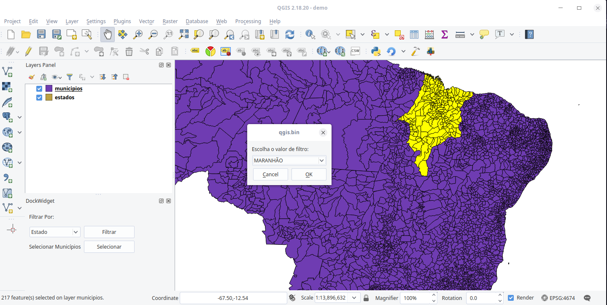

# City Finder
Plugin-tutorial do QGIS, documentado em português para versão 2.18.X

## Instalação e Configuração do QGIS
Siga as instruções no site oficial, atentados-se à versão utilizada.

- https://qgis.org/debian-ltr/
- https://qgis.org/en/site/forusers/alldownloads.html#linux

```sh
sudo apt-get update
sudo apt-get install qgis python-qgis qgis-plugin-grass python-qt4  python-qt4-dev
sudo apt-get install pyqt4-dev-tools qt4-designer
```

## Inicializando
Um plugin do QGIS possui uma estrutura básica com seguintes arquivos:

- \_\_init\_\_.py (__obrigatório__): Onde o plugin é inicializado. Deve conter o método `ClassFactory()` passando o a classe principal do seu plugin para indicar ao qgis por onde começar a carregar seu plugin.
- main_plugin.py (__obrigtório__): O arquivo que contém a classe principal e o código principal do seu plugin. Este arquivo pode ser nomeado de qualquer forma, desde que o `import` no arquivo de `init` seja feito apropriadamente.
- metadata.txt (__obrigatório__): Contém informações gerais de um plugin, como sua versão, nome e outros metadados.
- resources.qrc: Um arquivo `.xml` que pode ser criado pelo QtDesigner. Contém os caminhos relativos para recursos visuais (como imagens) e outros. Neste tutorial, criaremos este arquivo manualmente para carregar apenas o ícone do plugin.
- resources.py: É o compilado do `resources.qrc`
- icon.png: O arquivo do ícone do nosso plugin, obtido no site [iconfinder.com](//www.iconfinder.com/). Créditos ao autor [Aleksandr Reva](https://www.iconfinder.com/icons/1267304/bank_location_map_office_pin_icon).

## Compilando o arquivo .qrc
Para que os recursos visuais (ícones) sejam carregados no qgis pelo python, é necessário compilar o arquivo `.qrc`. Para isso, abra o terminal do OSGEO4W Shell, caso esteja no Windows, ou terminal normal do Linux e execute o comando, dentro da pasta do projeto:

```sh
pyrcc4 -o resources.py resources.qrc
```

Lembre-se que este comando só estará disponível no Linux após instalar a bilbioteca `pyqt4-dev-tools`.

## Adicionando o ícone
Vamos adicionar o ícone do plugin na barra de ferramentas de plugins. O QGIS reconhece automaticamente caso você declare um método na classe do seu plugin chamada `initGui`. Esse método é utilizado para inicializar a parte principal gráfica da interface do seu plugin. No caso, no momento, vamos apenas adicionar um ícone.

Os ícones nas barras de ferramentas são uma instância de [QAction](https://doc.qt.io/archives/qt-4.8/qaction.html) do QT pois executam uma ação quando ativados. Uma QAction pertence a biblioteca de `QtGui` e pode ter vários atributos associada a ela, como um ícone, uma descrição, um texto de ajuda e etc.

| Não se esqueça de importar o arquivo de resources gerado!

```python
from PyQt4.QtCore import *
from PyQt4.QtGui import *
from qgis.core import *
from qgis.gui import *
import resources
...

def initGui(self):
    icon_path = ":/plugins/city_finder/icon.png"
    self.button_action = QAction(
                            QIcon(icon_path),
                            "Plugin de filtro de cidades",
                            self.iface.mainWindow()
                        )
    # Adiciona o texto de ajuda a mais
    self.button_action.setWhatsThis("Este plugin realiza o filtro de municípios...")
    # Quando a ação for acionada, executa alguma coisa, no caso, o metodo executar
    self.button_action.triggered.connect(self.executar)
    # Adicionar na interface do QGIS, no menu ToolBar de plugins, a ação desejada
    self.iface.addToolBarIcon(self.button_action)

def executar(self):
    # executa o que tiver que executar no plugin
    print("Executou")
    pass

```

**Nota**: Estamos importando todas as bibliotecas no qt e do qgis no início do arquivo para praticidade. Mas dentre as boas práticas, é importante importar apenas o que se vai usar, até mesmo para aprender e entender de qual pacote cada elemento usado vêm (interface do gui, funcionalidades das bibliotecas cores, etc).

Vamos abrir o qgis e ativar o plugin! Vá ao menu de Complementos/Plugins e abra a janela de carregar plugins. Em  configurações, ative a opção de visualizar plugins experimentais. Volte na aba de plugins instalados e ative o nosso __City Filter__. Agora podemos ver nosso plugin! Caso clique no botão na barra de ferramentas (ao lado do ícone do Python), ele vai imprimir a mensagem de execução.

Toda vez que você fizer uma atualização no seu plugin, no entanto, será necessário reiniciar o QGIS. Para facilitar o desenvolvimento, existe um outro plugin chamado [Plugin Reloader](https://plugins.qgis.org/plugins/plugin_reloader/) que torna possível recarregar seu plugin que está sendo desenvolvido sem precisar reiniciar o QGIS. Vá em frente em plugins e instale-o!

Para usar o Realoder, no entanto, é necessário fazer uma alteração no nosso próprio plugin. Devemos adicionar um método de 'unload()`: um método que define o que é preciso ser feito para finalizar e fechar o plugin, como por exemplo, se houver um processo sendo executado em uma thread, finalizá-lo apropriadamente antes de reiniciar o plugin. No nosso caso, apenas queremos remover o icone e adicioná-lo novamente no menu, além de atualizar o código a ser executado.

```python
def unload(self):
    """Remove o seu icone da QGIS GUI."""
    self.iface.removeToolBarIcon(self.button_action)
```

## Menu Inicial e Interface
Vamos criar um menu inicial que será aberto assim que clicarmos no botão do nosso plugin usando o [QtDesigner](https://doc.qt.io/archives/qt-4.8/designer-manual.html). Abra o QtDesigner e escolha criar um novo Widget do tipo "[QDockWidget](https://doc.qt.io/archives/qt-4.8/qdockwidget.html)". Faça algo semelhante ao exemplo a seguir, seguindo a nomeação dos objetos:


Aqui, teremos uma QComboBox que permitirá filtrar dados com base na opção escolhida e apenas um botão que ativará uma opção de selecionar um município ao clicar sobre ele.

Crie um diretório chamado `ui/` em seu projeto e salve o arquivo como `main_docker.ui`. Não se esqueça de adicionar os arquivos vazios de **__init__.py** para que o diretório seja interpretado como um pacote!

Agora, crie um novo arquivo chamado main_docker.py e cole o código abaixo:

```python
# -*- utf-8 -*-
import os
from PyQt4 import QtGui, uic

FORM_CLASS, _ = uic.loadUiType(os.path.join(
    os.path.dirname(__file__), 'main_docker.ui'))


class CityFilterDockWidget(QtGui.QDockWidget, FORM_CLASS):
    def __init__(self, parent=None):
        """Constructor."""
        super(CityFilterDockWidget, self).__init__(parent)
        self.setupUi(self)
```

Aqui, é possível percebeber que estamos criando a classe da nossa interface estendendo a classe de `QtGui.QDockWidget` usando o código de interface gerado pelo designer. Assim, caso você tenha criado no designer um outro tipo de classe (QDialog - janela de diálogo, por exemplo) é necessário modificar o tipo da classe.

Esse código permite que você altere o arquivo `.ui` como quiser no qt designer e o que for construído lá será sempre carregado no Python com as devidas alterações.

Vamos agora carregar o Widget na interface do QGIS. Para isso, vamos importar a classe criada no arquivo criado anteriormente (`main_docker.py`) no plugin principal e vamos inicializar a instância do objeto no construtor de interface `initGui()` da classe:

```python
from ui.main_docker import CityFilterDockWidget

...

    def initGui(self):
        ...
        self.docker = CityFilterDockWidget()
```

Vamos agora fazer com que o Widget seja adicionado à interface sempre que clicarmos na ação do plugin. Ou seja, adicionar o código que abre a interface dentro do método `executar()`. Ele agora fica assim:

```python
def executar(self):
    """ Função que executa o plugin
    """
    self.iface.addDockWidget(Qt.LeftDockWidgetArea, self.docker)
    self.docker.show()
```

Escolhemos inicializar nosso docker no lado esquerdo da interface principal(`Qt.LeftDockWidgetArea`) e chamamos seu método de inicializar a interface `show()`.

## Criando as Funcionalidades do Plugin
No nosso docker, temos duas funcionalidades: `Filtrar por` `Selecionar Municípios`. A primeira, com base nas opções dentro da combo box, faremos com que as feições doos municípios que se enquadram naquele filtro sejam selecionados.

Antes de qualquer coisa, precisamos realizar o download das camadas que serão utilizadas no nosso projeto. [Acesse o link de download](https://drive.google.com/open?id=1-snIv2yOjBYMlX0UDEm4PBlmXUlrqjiK), descompacte a pasta e carregue as camadas no QGIS como demonstra a imagem a seguir:


Abrindo a tabela de atributos das duas camadas, vemos que os estados possuem nome (NM_ESTADO), uma região associada (NM_REGIAO) e um código (CD_GEOCUF). Já os municípios posssuem um nome (NM_MUNICIP) e um código (CD_GEOCMU). O código de cada município está atrelado ao estado ao qual pertence: os dois primeiros dígidos correspondem ao código de cada estado. Dessa forma, conseguimos combinar os dados nas duas tabelas para atingir nosso objetivo.


Vamos então adicionar funcionalidade aos botões que existem no nosso docker. para acessar os botões, lembre-se do nome dado a cada objeto criado no QtDesigner. Por exemplo, se abrirmos o arquivo xml `main_docker.ui` e procurarmos por algum objeto do tipo `QPushButton` podemos encontrar uma declaração do tipo:

```xml
<widget class="QPushButton" name="filtrar_button">
    <property name="text">
        <string>Filtrar</string>
    </property>
</widget>
```

A o valor da propriedade `name` será a que utilizaremos para acessar o nosso botão. No caso, o botão que possui o texto 'Filtrar`se chama `filtrar_button` e o botão que tem o texto se chama `selecionar_button`. Caso os seus botões possuem nomes que não são amigáveis como `button_1`, você pode alterá-los antes de começar a usá-los em código, mas o nome deve sempre coincidir com o que se chama no código Python.

Voltando então, vamos adicionar funcionalidade aos nossos botões. Assim que clicarmos no botão, queremos executar algum método que executará algum código que desejarmos. Então, após instanciar 'self.docker`, vamos chamar seus botões:

```python
def initGui(self):
    ...
    self.docker = CityFilterDockWidget()
    self.docker.filtrar_button.clicked.connect(self.filtrar)

def filtrar(self):
    print("Vamos Filtrar algo")
```

Aqui, estamos dizendo que, ao clicar no botão `filtrar_button`, chamamos a função `filtrar()` que foi criada e ela executa algo, que por enquanto é imprimir uma mensagem no terminal.

Antes de adicionar a funcionalidades no método `filtrar()`, vamos popular a combo box com as opções de filtro. Nossas opções de filtro são por: Estado ou Região. Vamos criar então uma lista (de texto mesmo) para então adicionar esses valores à combobox. Nossa combobox, no arquivo da interface do docket se chama `filtro_box`.

Antes, vale lembrar que, por "Região" ser uma palavra em português que precisa de codificação de caracteres e pelo QGIS 2 usar Python 2, vamos indicar explicitamente que essa string está em unicode com o `u`:

```python
def initGui(self):
    ...

    self.valores_combobox = [u'Estado', u'Região'] # lista com as opções
    self.docker.filtro_box.addItems(self.valores_combobox) # populando combobox

    self.docker.filtrar_button.clicked.connect(self.filtrar) # código anterior
```

### Pegando a Referência das Camadas
Neste tutorial, vamos levar em consideração que as camadas serão carregadas com o nome pré-definido e o nome não será alterado.

Para pegar a referência das camadas carregadas no QGIS, vamos usar o acesso ao canvas (`mapCanvas()`) da interface principal (`iface`) e identificaremos as camadas que vamos usar por seus nomes: __estados__ e __municipios__. Ambas camadas são camadas vetoriais [QgsVectorLayer](https://qgis.org/api/2.18/classQgsVectorLayer.html).

Criamos então um método que retorne as duas camadas necessárias e que, idependente de quais outras camadas estejam carregadas no mapa, retornaremos sempre as camadas de interesse.

```python
def pegar_camadas(self):
    municipios_layer = None
    estados_layer = None

    for layer in self.iface.mapCanvas().layers():

        if layer.name() == 'municipios':
            municipios_layer = layer
        elif layer.name() == 'estados':
            estados_layer = layer

    return municipios_layer, estados_layer
```

No método, inicializamos as variáveis que vão conter as camadas para que, caso as camadas de interesse não estejam carregadas, o retorno será nulo. Iteramos então sobre todas as camadas carregadas no QGIS `iface.mapCanvas().layers()` e verificamos o nome de cada uma. Se o nome coincidir com o nome que desejamos, salvamos a referência da camada para retornar.

Vamos agora fazer a chamada deste método no método `filtrar()` e vamos mandar imprimir o nome de ambas camadas se elas existirem:

```python
def filtrar(self):
    municipios_layer, estados_layer = self.pegar_camadas()
    if municipios_layer and estados_layer: # se ambas nao forem nulas
        print(municipios_layer.name())
        print(estados_layer.name())
```

Ao executar o plugin, se tudo der certo, veremos o nome de cada camada impresso no terminal Python.

### Método filtrar()
No código anterior, vamos adicionar o código a ser adicionado dependendo da opção escolhida. Se for por Estado, executa um método, se for por regiões, executa outro. isso pode ser feito acessando o valor atual (após o botão ter sido apertado) da combobox do docker e fazendo comparações. O método `filtrar()` então vai ficar assim.

```python
def filtrar(self):
    municipios_layer, estados_layer = self.pegar_camadas()

    if municipios_layer and estados_layer: # se ambas nao forem nulas
        # se opção selecionada for por Estado, executa metodo equivalente
        if self.docker.filtro_box.currentText() == u'Estado':
            self.por_estado(municipios_layer, estados_layer)

        #se opção selecionada for por Região, executa metodo equivalente
        elif self.docker.filtro_box.currentText() == u'Região':
            self.por_regiao(municipios_layer, estados_layer)
```

Note que estamos passando a referência das camadas úteis, pois precisaremos delas para acessar os dados e fazer os filtros. As strings, novamente, estão sendo tratadas como _unicode_.

Agora vamos desenvolver a lógica o método `por_estado()`. A lógica deve seguir os seguintes passos:

1. Criar uma classe de janela de diálogo ([QDialog](https://www.riverbankcomputing.com/static/Docs/PyQt4/qdialog.html)) que permita o usuário escolher, em uma combo box, qual estado ou região ele deseja filtrar por;
2. Identificar o index da coluna *NM_STADO* (ou *NM_REGIAO*) na tabela;
3. Pegar a lista dos valores únicos que existem nesta coluna (caso exista um estado com nome repetido, o segundo será ignorado e no caso de regiões, pegaremos apenas os valores distintos)
4. Popular a combobox e criar a instância da janela de diálogo;
5. Executar a janela de diálogo e, se tudo estiver ok, pegar o valor que foi escolhido (nome do estado ou região desejado);
6. Pegar a referência da feição que representa aquele estado (ou feições, se estivermos filtrando por região que contenha mais de um estado);
7. Criar um filtro que será executado na camada de municipios, selecionando todos os municípios que o código comece com o código do estado escolhido (a query de busca é do tipo SQL!). No caso da região, criaremos uma SQL que o filtro englobe um estado __ou__ outro __ou__ outro, etc.

Alguns desses passos, no momento, não terão explicações muito aprofundadas, pois o objetivo deste tutorial é introduzir o desenvolvimento de plugins. Ao final desta página, serão apresentados algumas referências e exercícios de continuação, caso queira aprofundar seus estudos no assunto (QGIS, Python ou QT).


### Janela de Diálogo FiltroDialog()
Ao clicar no botão `Filtrar` no docker do plugin, é necessário escolher então, especificamente, por qual estado (ou região) desejamos filtrar os municípios. Para isso, criaremos uma janela de diálogo `QDialog` que conterá um combobox com as opções de escolha.

Vamos então criar um arquigo chamado `filer_dialog.py` no diretório `ui/` do nosso plugin.  Dentro, vamos ter o seguinte código:


```python
# -*- coding: utf-8 -*-
from PyQt4.QtGui import (QDialog, QVBoxLayout,
                         QDialogButtonBox, QLabel,
                         QComboBox)
from PyQt4.QtCore import Qt


class FilterDialog(QDialog):
    def __init__(self, opcoes_list, parent=None):
        super(FilterDialog, self).__init__(parent)
        """ Janela de dialogo criada independente
        (como uma opção ao uso do qt designer)
        """

        # Cria um layout para a  sua janela de input QDialog
        self.layout = QVBoxLayout(self)

        #Cria um label e adiciona no layout
        self.label = QLabel(u"Escolha o valor de filtro:")
        self.layout.addWidget(self.label)

        # Cria combobox com a lista de opcoes a escolher
        # e adicionar no layout
        self.filtro_box = QComboBox()
        self.filtro_box.addItems(opcoes_list)
        self.layout.addWidget(self.filtro_box)

        # Cria botoes de submeter e adiciona ao layout
        self.buttons =  (
            QDialogButtonBox.Ok | QDialogButtonBox.Cancel,
            Qt.Horizontal, self)
        self.buttons.accepted.connect(self.accept)
        self.buttons.rejected.connect(self.reject)
        self.layout.addWidget(self.buttons)

    def valor_atual(self):
        """ Retorna qual  valor atual na combo box (valor escolhido) """
        return self.filtro_box.currentText()

```

#### Explicação da janela de filtro

Neste código, criamos a classe FilterDialog que é baseada em uma `QDialog`. Adicionamos então, no seu contrutor, toda a interface.

Começamos pela criação de um layout do tipo vertical, em que os widgets adicionados ao nosso layout seriam inseridos um em baixo do outro ([QVBoxLayout](https://doc.qt.io/archives/qt-4.8/qvboxlayout.html), se fosse horizontal QHBoxLayout e widgets estariam um ao lado do outro).

Em seguida, adicionamos então um label (texto explicativo) com instruções para o usuário. Criamos uma QComboBox que conterá a lista das opções a serem escolhidas. Por fim, adicionamos os botões de aceitar ou cancelar a ação da combo box. Para explicação no funcionamento destes, recomendo uma consulta à documentação de [QDialogButtonBox](https://doc.qt.io/archives/qt-4.8/qdialogbuttonbox.html).

Por fim, temos um método que será chamado externamente para retornar o valor atual (escolhido pelo usuário) se a janela for executada corretamente.

### Método por_estado()
Voltando ao código de filtro por estados, vamos então pegar todos os nomes de estados existentes na tabela de atributos e criar nossa janela de filtro passando esta lista de opções.

Para isso, primeiro precisamos pegar a referência da coluna de estados na camada de estados e, em seguida, a lista de todos os estados com nome único na tabela usando o método da classe QgsVectorLayer chamado `uniqueValues()`:

```python
def por_estado(self, municipios_layer, estados_layer):
    index_coluna = estados_layer.fieldNameIndex('NM_ESTADO')
    lista_de_estados = estados.uniqueValues(index_coluna)
```

Agora, vamos passar a lista retornada para a janela de diálogo que vamos criar e, vamos executar a janela:

```python
from ui.filter_dialog import FilterDialog

...


def por_estado(self, municipios_layer, estados_layer):
    index_coluna = estados_layer.fieldNameIndex('NM_ESTADO')
    lista_de_estados = estados.uniqueValues(index_coluna)

    janela_filtro = FilterDialog(lista_de_estados)
    resultado = janela_filtro.exec_()
```

Se o resultado de retorno for positivo, vamos então pegar o valor selecionado, usando o método da classe `valor_atual()` que criamos anteriormente.


```python
def por_estado(self, municipios_layer, estados_layer):
    ...

    janela_filtro = FilterDialog(lista_de_estados)
    resultado = janela_filtro.exec_()
    if resultado:
        nome_estado = janela_filtro.valor_atual()
```

#### Busca de Features

Usando o nome do estado, precisamos pegar a feição correspondende ao mesmo na camada de estados. Para isso, vamos criar um método auxiliar que cria expressão que acha feições com base no nome de uma coluna e seu valor equivalente naquela coluna. Faremos essa função de forma genérica para que consigamos pegar tanto um estado quanto os estados dentro de uma região.
```python
def pegar_por_nome(self, camada, tipo_campo, nome):

    expression = QgsExpression(
        '"{tipo}" LIKE \'{nome}\''.format(
            tipo=tipo_campo, nome=nome)
        )

    features_iterator = camada.getFeatures(QgsFeatureRequest(expression))

    return [feat for feat in features_iterator]
```

o método acima cria uma expressão do tipo [QgsExpression](https://qgis.org/api/2.18/classQgsExpression.html) em que o tipo (nome da coluna) é igual ao valor passado (nome específico do estado ou região). ou seja, teríamos uma expressão do tipo **"NM_ESTADO" LIKE 'GOIÁS'** para encontrar a feição com informações do estado de Goiás.

Essa expressão então é usada para fazer uma requisição/busca de feições ([QgsFeatureRequest](https://qgis.org/api/2.18/classQgsFeatureRequest.html)) usando o método getFeatures() da camada em que se deseja buscar.

Veja que, no final, o `getFeatures()` retorna um [iterador](https://anandology.com/python-practice-book/iterators.html) de feições e não uma lista de feições e, por isso, precisamos iterar sobre o mesmo para criar a nossa lista de feições a serem retornadas.

**Nota**: Essas queries/expressões dentro do QGIS referenciam colunas com aspas duplas e texto/string com aspas simples.

## Método por_estado() parte 2
Voltando ao filtro por estado, usamos o nosso método criado anteriormente para obter a feição que represente o estado desejado, mas obtendo apenas o primeiro valor retornado (caso exista outro estado com o mesmo nome, este será completamente ignorado aqui).

Acessamos a tabela de atributos da feição do estado escolhido para obter o seu código e, usando o método `selectByExpression()` da camada de municipios, selecionamos todos os municípios com uma expressão de filtro que busca por todos que possuam o código que se inicia com o código do estado. Por exemplo, se o código (valor na coluna **CD_GEOCUF** de estados) do estado de Goiás é **52**, nossa query dentro de municípios ficaria do tipo **"CD_GEOCMU" LIKE '52%'**, onde o `%` representa que qualquer outro valor pode existir depois do 52.

No fim, este método ficaria parecido com o seguinte:


```python
def por_estado(self, municipios_layer, estados_layer):
    index_coluna = estados_layer.fieldNameIndex('NM_ESTADO')

    lista_de_estados = estados_layer.uniqueValues(index_coluna)

    janela_filtro = FilterDialog(lista_de_estados)

    if janela_filtro.exec_():

        nome_estado = janela_filtro.valor_atual()
        estado_escolhido = self.pegar_por_nome(estados_layer, 'NM_ESTADO', nome_estado)[0]

        # pega código ID do estado
        id_estado = estado_escolhido['CD_GEOCUF']

        filtro_municipio = '"CD_GEOCMU" LIKE \'{id}%\''.format(id=id_estado)
        municipios_layer.selectByExpression(filtro_municipio) # seleciona as features desejadas
```



## Método por_regiao()
O código do método por região é muito semelhante ao de por estado, so que agora, vamos iterar sobre a lista retornada na busca de `pegar_por_nome()` e vamos criar uma query que filtre todos os municípios que pertencem a vários estados que compõem a região:

```python
    def por_regiao(self, municipios, estados):
        index_coluna = estados.fieldNameIndex('NM_REGIAO')

        lista_de_regioes = estados.uniqueValues(index_coluna)

        janela_filtro = FilterDialog(lista_de_regioes)

        if janela_filtro.exec_():
            nome_regiao = janela_filtro.valor_atual()

            estados_na_regiao = self.pegar_por_nome(estados, 'NM_REGIAO', nome_regiao)

            # inicia a expressão SQL
            filtro_municipio = ''

            # para cada estado, adiciona uma expressão de filtro de municipios
            for estado in estados_na_regiao:
                id_estado = estado['CD_GEOCUF']

                # se ja existir algo na expressão, adiciona um OR pra continuar criando
                if filtro_municipio:
                    filtro_municipio += ' OR '

                filtro_municipio += '"CD_GEOCMU" LIKE \'{id}%\''.format(id=id_estado)

            municipios.selectByExpression(filtro_municipio)
```

## Selecionar Municípios com um Clique
Agora, vamos adicionar a funcionalidade ao outro botão no nosso docker. Olhando no nosso arquivo de xml `main_docker.ui`, vemos que este botão é chamado de `selecionar_button`. Adicionaremos então no nosso plugin no método de `initGui()` a opção realizar uma ação, que será a de executar o método `selecionar()` ( que também será criado) quando clicarmos no botão:

```python
def initGui(self):
    ...
    # Adicionar botão de selecionar municipio
    self.docker.selecionar_button.clicked.connect(self.selecionar)

def selecionar(self):
    print("Selecionou")

```

Queremos que, quando clicamos no botão, seja acionado uma nova ferramenta que permite clicae no mapa e selecionar uma feição da camada e, caso clicarmos no botão novamente, essa funcionalidade seja desativada. Esse tipo de botão é cohecido como _checkable_. Devemos então fazer com que o nosso botão seja checkable apenas definido como verdadeira essa sua propriedade (que por padrão é Falsa):

```python
def initGui(self):
    ...
    self.docker.selecionar_button.setCheckable(True)
    self.docker.selecionar_button.clicked.connect(self.selecionar)
```

Em seguida, no método `selecionar()` precisamos ter a lógica para que, quando ativado, ele funcione como selecionador de feições, e quando desativado, ele interrompa suas atividades. Observe o código a seguir:

```python
def selecionar(self):
    if self.docker.selecionar_button.isChecked():
        print("Foi ativado")
    else:
        print("Desativando a ferramenta!")
```

Fizemos o que foi proposto verificando se nosso botão foi checado (`isChecked`) ou não. Caso esteja checado ou não, a mensagem no terminal adequada é imprimida.

Antes de prosseguirmos com o código deste método `selecionar()`. Precisamos primeiro definir que ferramenta é esta que vamos utilizar!

### Criando uma QgsMapTool Personalizada

A [QgsMapTool](https://qgis.org/api/2.0/classQgsMapTool.html) é uma classe que permite ser extendida para que você consiga criar uma ferramenta própria que faça manipulações de eventos dentro do canvas do mapa. Por exemplo, criando uma classe do tipo, é possível desenhar polígonos do mapa, identificar quando um evento de clique com botão direito ou esquerdo foi realizado, dentre outras coisas.

Vamos então criar um novo arquivo `select_tool.py` dentro de um diretório (também novo) chamado `lib/`. Vamos adicionar o seguinte código inicial:

```python
from qgis.gui import QgsMapTool


class SelectTool(QgsMapTool):
    def __init__(self, canvas):
        QgsMapTool.__init__(self, canvas)
        self.canvas = canvas

    def canvasPressEvent(self, event):
        print(event.x(), event.y())

```

Criamos a nossa classe da ferramenta do tipo `QgsMapTool`. Vale lembrar aqui que a classe a qual se está herdando **precisa** receber, como parâmetro, o acesso ao canvas do mapa. Este então deve ser passado para a nossa classe assim que inicializarmos a instância do nosso `SelectTool()` no código principal do nosso plugin.

O método `canvasPressEvent()` é um método base da classe que se herda e sempre é chamado quando o clique do mouse é pressionado no canvas do mapa. Ou seja, ele já é chamado interativamente dentro do QGIS e executado quando a ação mencionada é realizada. No nosso caso, quando um evento (clique) for executado, a coordenadas x e y do clique serão impressas no terminal. Recomendo a leitura da documentação original para entender as possibilidades.

Vamos agora executar nossa ferramenta para realizar o teste do clique. No arquivo principal do plugin, modifique o código do método selecionar() para o seguinte:


```python
def selecionar(self):
        try:
            self.select_tool
        except AttributeError:
            self.select_tool = SelectTool(self.iface.mapCanvas())

        if self.docker.selecionar_button.isChecked():
            self.iface.mapCanvas().setMapTool(self.select_tool)

        else:
            self.iface.actionPan().trigger()
```

Apenas adicionamos a criação do objeto da ferramenta caso não exista (passando a referência do canvas através da interface principal do qgis `iface`). Adicionamos também o código que ativa a nossa ferramenta caso o plugin seja ativado e desativa a ferramente (ativando a ferramenta de navegação de mapas padrão do QGIS) caso contrário.

### Selecionando Municípios
Vamos agora adicionar a funcionalidade final de selecionar municípios com o clique. No arquivo da nossa ferramente `select_too.py`, modificaremos o contrutor para receber a camada de municípios além de receber o canvas.

```python
from qgis.gui import QgsMapTool


class SelectTool(QgsMapTool):
    def __init__(self, canvas, municipios_layer):
        QgsMapTool.__init__(self, canvas)
        self.canvas = canvas
        self.municipios_layer = municipios_layer

```

Já no método de cuida dos eventos de clique no mapa da ferramenta, vamos adicionar um código que faça a seleção de alguma feição a qual se clicou em cima:

```python
    def canvasPressEvent(self, event):

        if not self.municipios_layer.isValid():
            return

        layer = self.municipios_layer

        # Aqui estamos definindo como a identificação deve ser feita
        inicio_identificacao = QgsMapToolIdentify.TopDownStopAtFirst

        # usando  a ferramenta para ver se o local onde clicamos (x,y do evento de clique)
        # pertence a uma feição da camada
        feicoes_clicadas = QgsMapToolIdentify(self.canvas).identify(
            event.x(),
            event.y(),
            [layer],
            inicio_identificacao
        )

        # se existir, seleciona só a primeira feição retornada na identificação
        if len(feicoes_clicadas) > 0:
            municipio_selecionado = feicoes_clicadas[0].mFeature
            self.municipios_layer.select(municipio_selecionado.id())
```

Primeiro verificamos se a camada de municípios é valida para dar continuidade. Em seguida, usamos a ferramenta [QgsMapToolIdentify](). Essa próxima linha de código obtém uma informação que será necessária para a seleção: o tipo de seleção que deve acontecer. No caso, vamos fazer com que a feição selecionada seja a primeira de cuma pra baixo e, quando identificada, para por ali (não pega mais nenhuma outra, mesmo que existam feições por baixo) - _TopDownStopAtFirst_.

A próxima linha realiza a verificação de fato: usando a _QgsMapToolIdentify_ sobre o canvas, tentandos identificar se, na posição de x e y do clique (evento), existe alguma feição na camada indicada. A resposta dessa chamada retorna uma lista de seleções.

Caso uma feição tenha sido identificada (lista maior que 0), pegamos apenas a primeira feição e selecionamos ela diretamente na camada com o método `select()` da _QgsVectorLayer_.


## Considerações Finais
Muitos detalhes sobre funcionamento do QGIS ou explicação de como cada classe do PyQt e do PyQgis funcionam foi omitido deste tutorial, pois a ideia é dar uma introdução ao tópico. Versões futuras podem incluir explicações mais detalhadas. É importante sempre procurar a documentação oficial das classes utilizadas para saber do seu funcionamento e limitações.

## PluginBuilder
É possível começar a constriuir um plugin de forma mais simples e limpa, sem precisar criar todos os arquivos obrigatórios mencionados no começo do tutorial manualmente. isso é possível utilizando o plugin chamado [PluginBuilder](https://plugins.qgis.org/plugins/pluginbuilder/). Consulte a [documentação](https://github.com/g-sherman/Qgis-Plugin-Builder/blob/master/help/source/index.rst) para mais informações.

## Exercícios
É possível extender o plugin para que funcione da melhor forma possível. Seguem algumas modificações sugeridas, caso queria trabalhar mais a fundo e pesquisar por conta própria como fazer, para aprender ainda mais:

- Tratar erros de quando as camadas não forem válidas;
- Deixar usuário escolher quais são as camadas de municipio e estados, para que não seja dependente do nome. Isso pode ser atingindo listando todas as camadas existentes em duas combobox: uma para escolher municipio e outra para escolher estados;
- Quando clicar no município desejado, imprimir em uma janela de informações, dados sobre ele na tabela de atributos: nome, código, estado, região;
- Fixar a altura mínima do plugin para que quando o docker for carregado, não precise ajustar seu tamanho para visualização.

## Referências
- [PyQgis Developer Cookbook Official - QGIS 2](https://docs.qgis.org/2.18/pdf/en/QGIS-2.18-PyQGISDeveloperCookbook-en.pdf) | [Versão em Português](https://docs.qgis.org/2.18/pt_BR/docs/pyqgis_developer_cookbook/)
- [Tutorials Point: PyQt](https://www.tutorialspoint.com/pyqt/)
- [Pythonprogramming: PyQt Tutorial](https://pythonprogramming.net/basic-gui-pyqt-tutorial/)
- [PyQgis 101](https://anitagraser.com/pyqgis-101-introduction-to-qgis-python-programming-for-non-programmers/)


